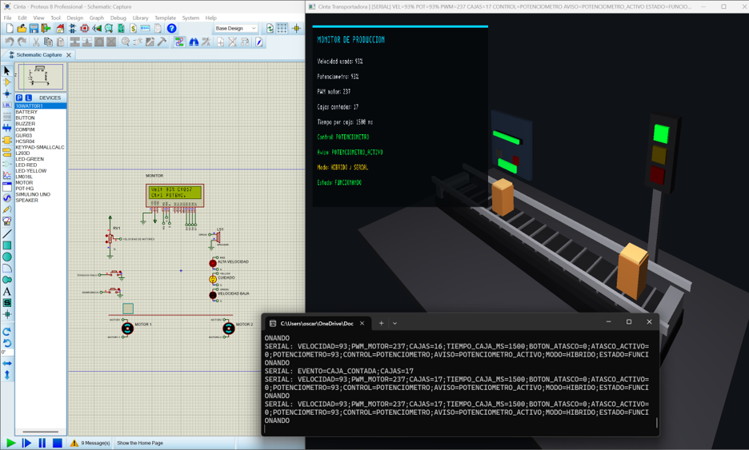
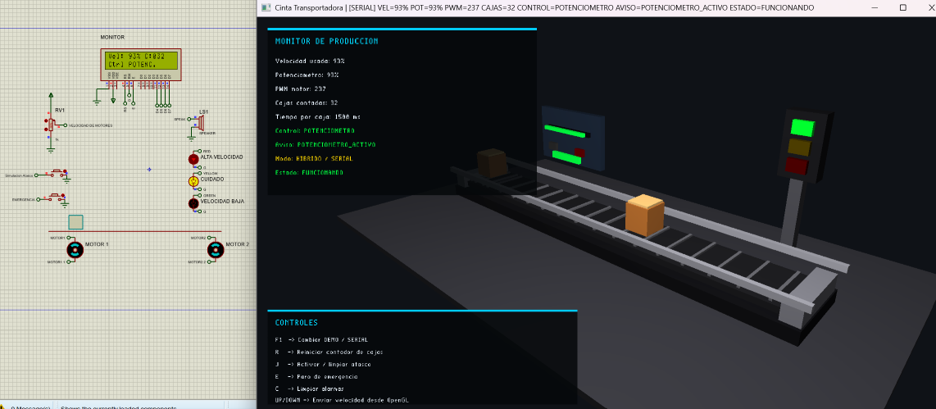
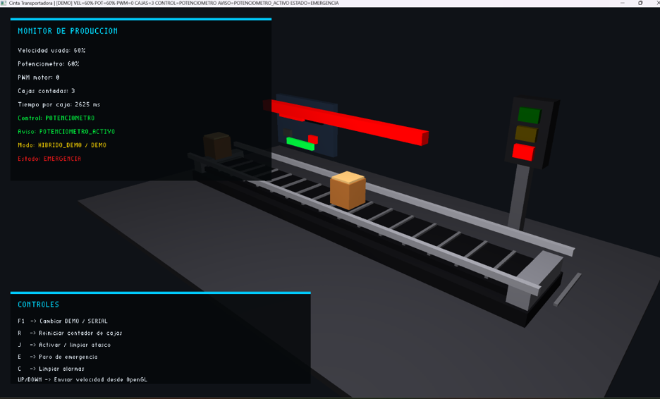
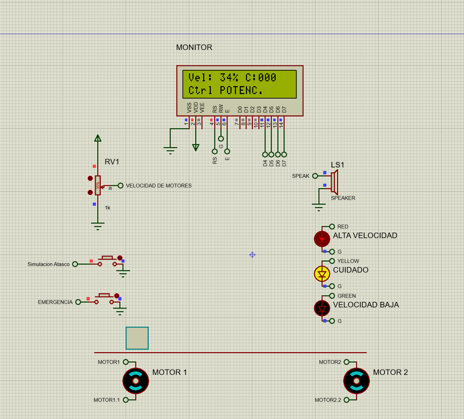
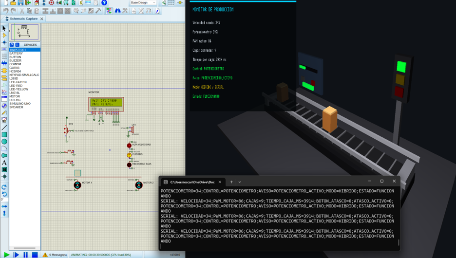
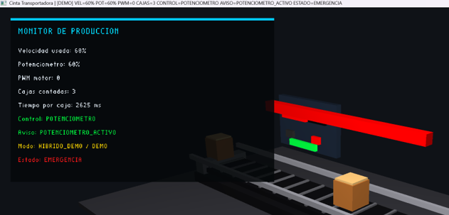

# 🏭 Cinta Transportadora - Industria 4.0

<p align="center">
  
</p>

<p align="center">


</p>

---

# 📌 Descripción

**Cinta Transportadora - Industria 4.0** es un sistema de automatización industrial desarrollado como proyecto académico en la **Escuela Politécnica Nacional**.

Integra una simulación electrónica realizada en **Proteus**, el control mediante **Arduino UNO** y una representación gráfica tridimensional desarrollada en **OpenGL**, comunicándose en tiempo real mediante comunicación serial.

---

# ✨ Características

- 🏭 Simulación de una línea de producción industrial.
- 🖥️ Representación gráfica 3D mediante OpenGL.
- 🔌 Comunicación serial entre Arduino y OpenGL.
- ⚙️ Simulación electrónica completa en Proteus.
- 🎛️ Control de velocidad mediante potenciómetro.
- 📦 Conteo automático de cajas.
- 🚦 Semáforo industrial.
- 🚨 Paro de emergencia.
- ⚠️ Simulación de atascos.
- 📊 Monitor de producción en tiempo real.

---

# 🏗 Arquitectura

```text
                 Potenciómetro
                       │
                       ▼
                  Arduino UNO
                       │
                       ▼
               Simulación Proteus
                       │
            Comunicación Serial
                       │
                       ▼
                 Simulación OpenGL
                       │
                       ▼
      Cinta • Cajas • Monitor • Producción
```

---

# 📸 Vista general del proyecto

<p align="center">

</p>

La integración entre Proteus y OpenGL permite visualizar en tiempo real el comportamiento del sistema industrial mientras Arduino controla la lógica del proceso.

---

# 🖥️ Simulación 3D

<p align="center">

</p>

El simulador desarrollado en OpenGL representa la cinta transportadora, las cajas, los indicadores luminosos y el monitor de producción.

---

# 🔌 Circuito electrónico

<p align="center">

</p>

La simulación en Proteus incorpora:

- Arduino UNO
- LCD 16x2
- Potenciómetro
- L293D
- Motores DC
- LEDs indicadores
- Buzzer
- Botones de emergencia y atasco

---

# 📡 Comunicación Serial

<p align="center">

</p>

Los datos enviados por Arduino son recibidos por OpenGL mediante comunicación serial, permitiendo sincronizar la simulación gráfica con el comportamiento del circuito electrónico.

---

# 📊 Monitor de Producción

<p align="center">

</p>

El sistema supervisa en tiempo real:

- Velocidad de la cinta.
- Conteo de cajas.
- Estado del sistema.
- Modo de operación.
- Producción acumulada.
- Alertas de emergencia y atasco.

---

# 🛠 Tecnologías utilizadas

| Tecnología | Función |
|------------|---------|
| C++ | Desarrollo principal |
| OpenGL | Simulación 3D |
| GLFW | Ventanas y entrada |
| GLAD | Inicialización OpenGL |
| Arduino UNO | Control del sistema |
| Proteus | Simulación electrónica |
| Comunicación Serial | Intercambio de datos |
| Git | Control de versiones |
| GitHub | Hospedaje del proyecto |

---

# 📂 Estructura del proyecto

```text
Cinta-Transportadora-Industria-4.0
│
├── Arduino/
├── OpenGL/
├── Proteus/
├── docs/
│   └── Informe_Tecnico_Cinta_Transportadora_OpenGl_Proteus.docx
├── images/
│   ├── portada.png
│   ├── integration.png
│   ├── opengl.png
│   ├── proteus.png
│   ├── serial.png
│   └── monitor.png
│
└── README.md
```

---

# 🚀 Instalación

## Clonar el repositorio

```bash
git clone https://github.com/OscarFierro22/Cinta-Transportadora-Industria-4.0.git
```

## Ejecutar Proteus

Abrir el circuito ubicado en la carpeta **Proteus** y cargar el programa del Arduino.

## Configurar comunicación serial

Ejemplo:

```text
Proteus → COM5

OpenGL → COM6
```

## Ejecutar OpenGL

Abrir la solución en Visual Studio, compilar y ejecutar el proyecto.

---

# 📄 Documentación técnica

📥 **[Descargar Informe Técnico](docs/Informe_Tecnico_Cinta_Transportadora_OpenGl_Proteus.docx)**

---

# 🎯 Objetivos del proyecto

- Aplicar conceptos de Industria 4.0.
- Integrar simulación electrónica y computación gráfica.
- Implementar comunicación serial.
- Desarrollar una simulación interactiva en tiempo real.
- Representar procesos industriales mediante OpenGL.

---

# 👨‍💻 Autor

**Oscar Fierro**

Estudiante de Ingeniería de Software

Escuela Politécnica Nacional

---

# 🚀 Trabajo futuro

- Comunicación mediante TCP/IP.
- Integración con hardware físico.
- Dashboard web.
- Base de datos de producción.
- Aplicación móvil.
- Integración con IoT.
- Estadísticas en tiempo real.

---

# 📄 Licencia

Proyecto académico desarrollado con fines educativos.

Escuela Politécnica Nacional.
